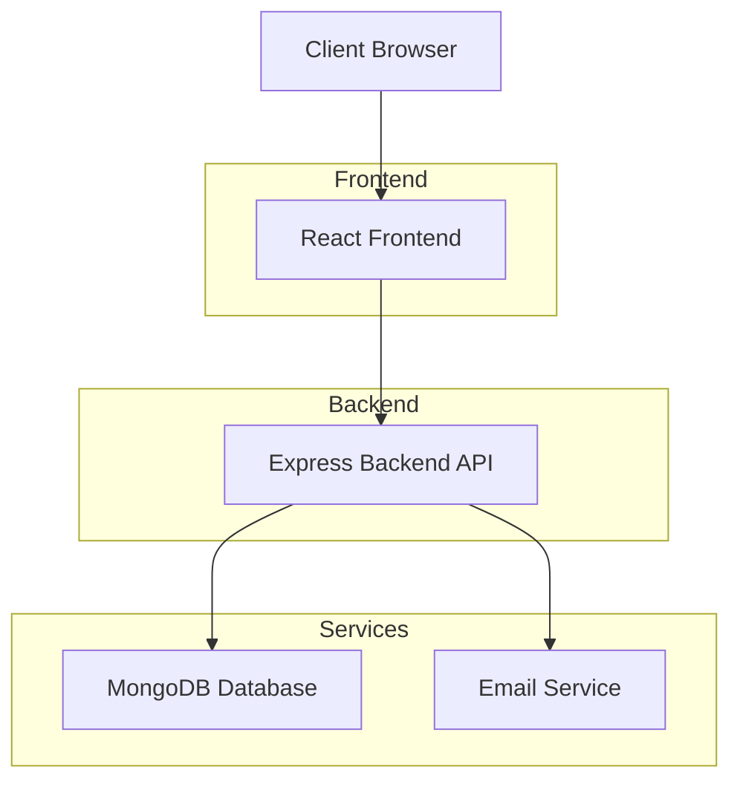
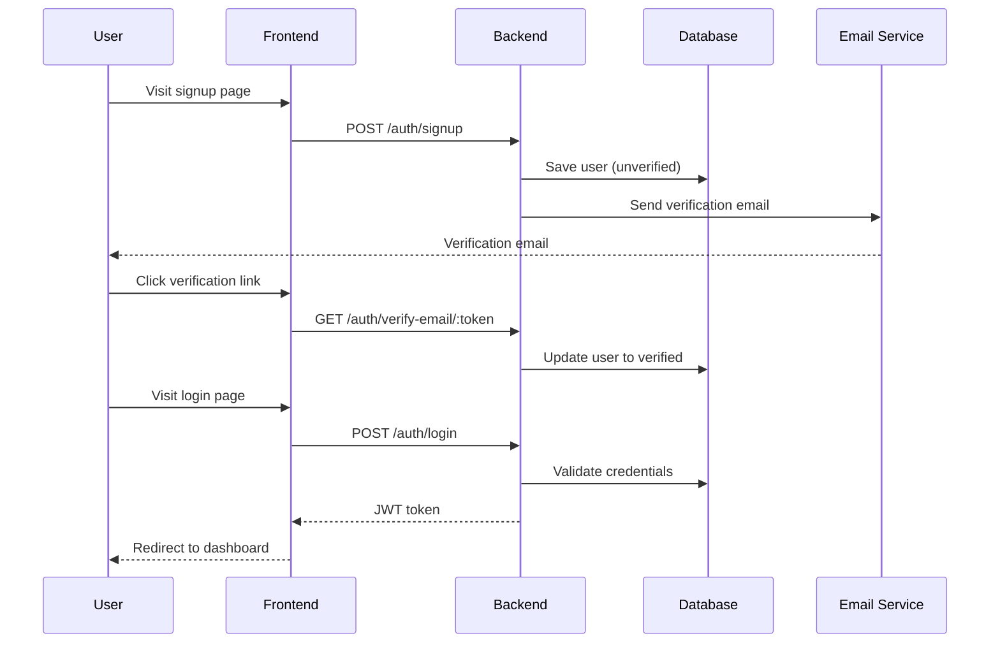
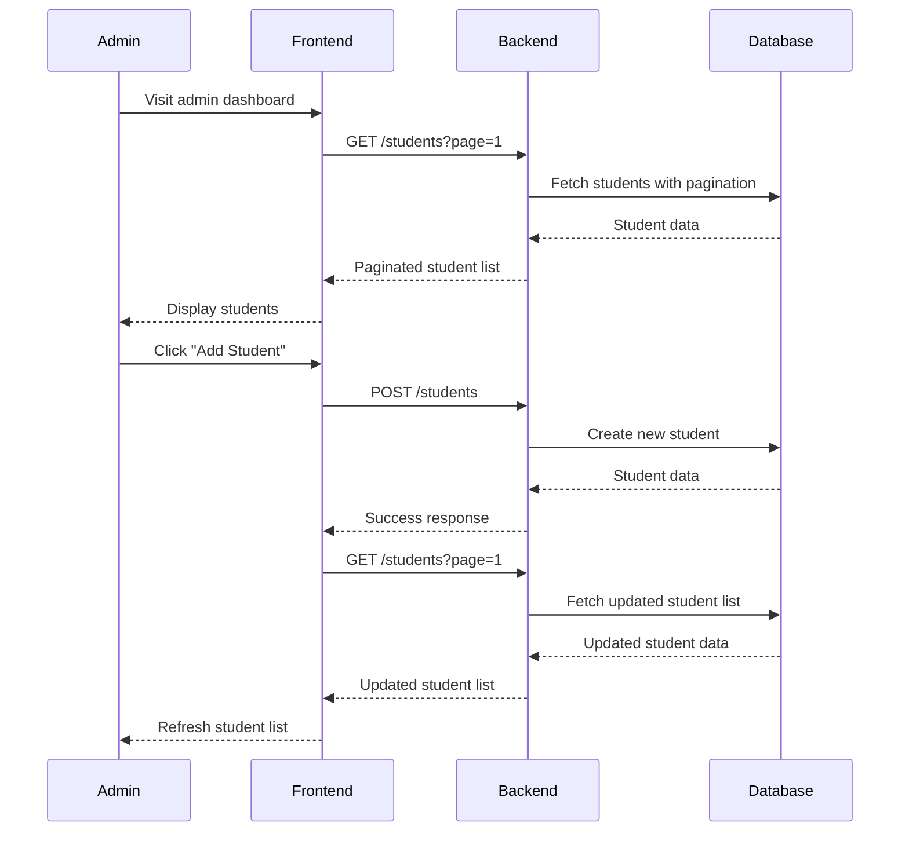
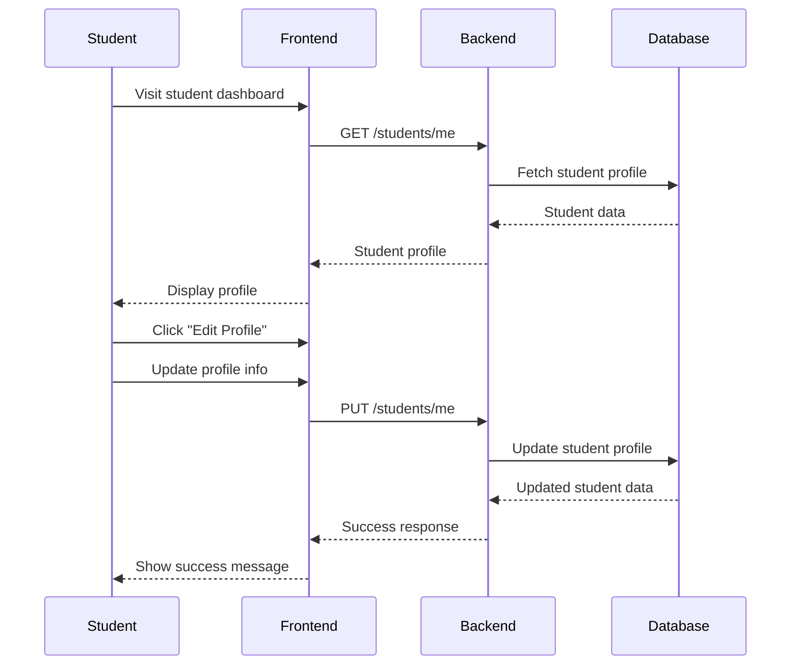

# Application Architecture

## System Diagram



## Component Interactions

### Authentication Flow


### Admin Student Management


### Student Profile Management


## Data Models

### User Model
```javascript
{
  name: String,
  email: String (unique),
  password: String (hashed),
  role: String (admin|student),
  isVerified: Boolean,
  resetPasswordToken: String,
  resetPasswordExpires: Date,
  timestamps: { createdAt, updatedAt }
}
```

### Student Model
```javascript
{
  name: String,
  email: String (unique),
  course: String,
  enrollmentDate: Date,
  user: ObjectId (ref to User),
  timestamps: { createdAt, updatedAt }
}
```

## API Layer

### Authentication Endpoints
- `/api/auth/signup` - Public
- `/api/auth/verify-email/:token` - Public
- `/api/auth/login` - Public
- `/api/auth/forgot-password` - Public
- `/api/auth/reset-password/:token` - Public
- `/api/auth/change-password` - Protected (Authenticated users)

### Student Endpoints
- `/api/students` - Protected (Admin only)
- `/api/students/me` - Protected (Student only)
- `/api/students/:id` - Protected (Admin only)

## Security Layers

1. **Network Layer**: HTTPS in production
2. **Authentication Layer**: JWT tokens
3. **Authorization Layer**: Role-based middleware
4. **Data Layer**: Input validation and sanitization
5. **Application Layer**: Error handling without information leakage